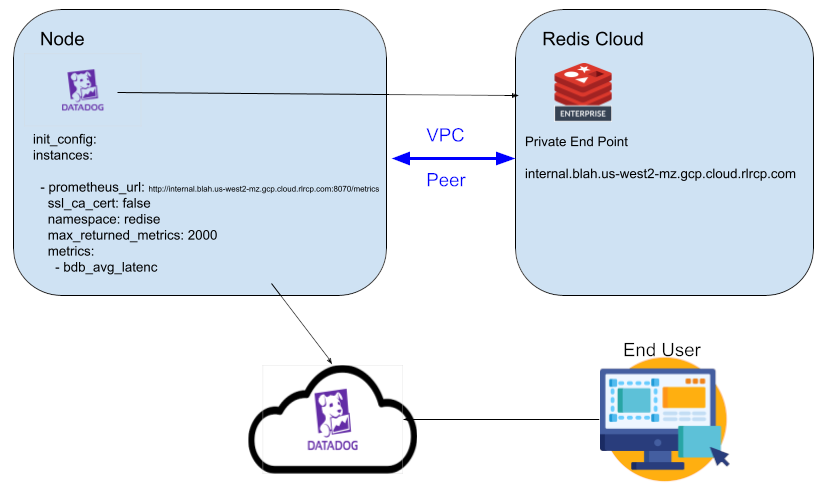
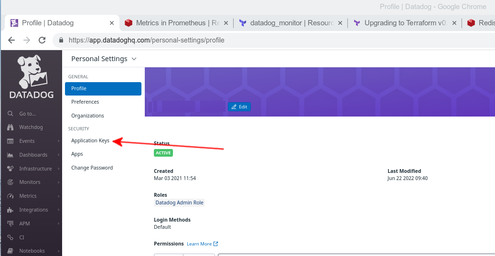
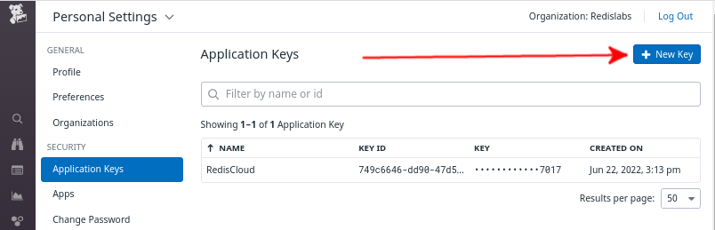
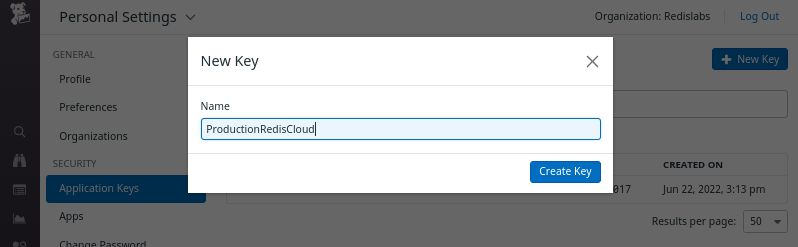
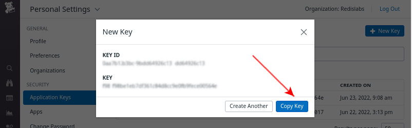
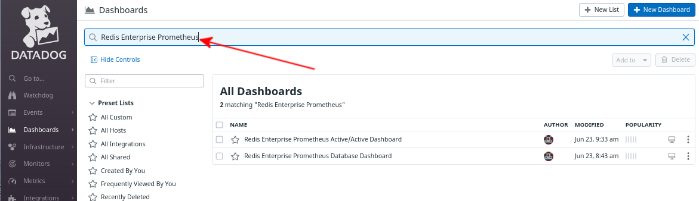
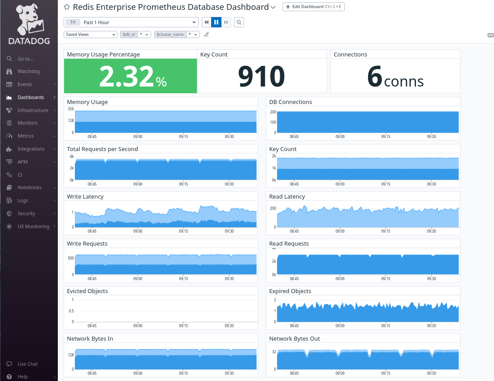
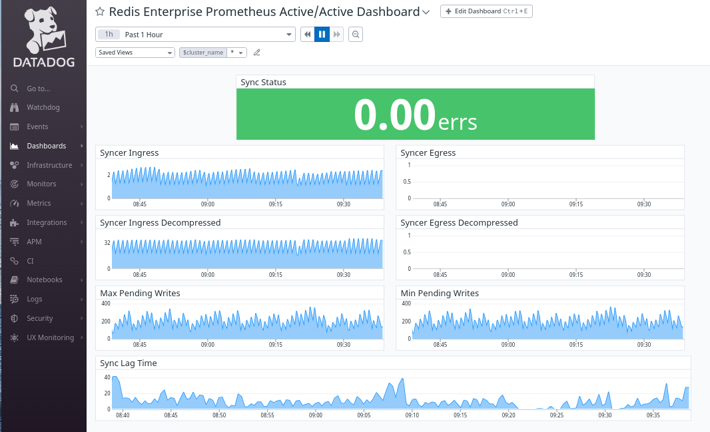
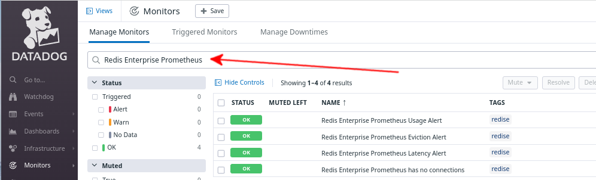
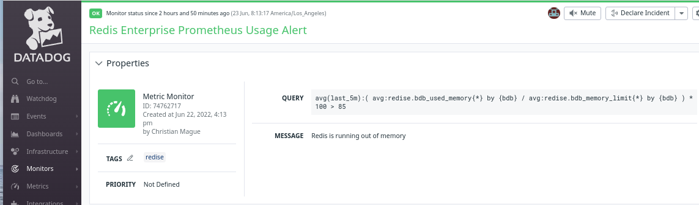

# Setting up Datadog for Redis Cloud

The Datadog Agent will run on any node that is peered with Redis Cloud and submit metrics to Datadog's cloud service.



## Pre-reqs
1. Datadog Agent installed and running on a node in a peered VPC
2. Terraform version >= 1.2.3 installed on workstation to setup the dashboard and alerts [get here](https://www.terraform.io/downloads.html)

## Setting up Access

### Configuring Datadog Agent to Collect Data

```
cd /etc/datadog-agent/conf.d/prometheus.d/
sudo cp conf.yaml.example conf.yaml
```

edit the conf.yaml file

##### Use the Private endpoint
##### remove the redis-# at the beginning 
```
redis-15127.internal.blah.us-west2-mz.gcp.cloud.rlrcp.com:15127
                 should be
internal.blah.us-west2-mz.gcp.cloud.rlrcp.com
```

Note: you can check your endpoint to be sure by running curl 

```
curl -sk https://internal.blah.us-west2-mz.gcp.cloud.rlrcp.com:8070/metrics

```

```
init_config:

instances:
  - prometheus_url: https://internal.blah.us-central1-mz.gcp.cloud.rlrcp.com:8070/metrics
    ssl_ca_cert: false
    namespace: redise
    max_returned_metrics: 2000
    metrics:
      - bdb_avg_latency
      - bdb_avg_latency_max
      - bdb_avg_other_latency
      - bdb_avg_read_latency
      - bdb_avg_write_latency
      - bdb_conns
      - bdb_egress_bytes
      - bdb_evicted_objects
      - bdb_expired_objects
      - bdb_fork_cpu_system
      - bdb_ingress_bytes
      - bdb_main_thread_cpu_system
      - bdb_main_thread_cpu_system_max
      - bdb_memory_limit
      - bdb_no_of_keys
      - bdb_other_req
      - bdb_read_req
      - bdb_shard_cpu_system
      - bdb_shard_cpu_system_max
      - bdb_total_req
      - bdb_total_req_max
      - bdb_used_memory
      - bdb_write_req
      - listener_acc_latency
      - listener_conns
      - listener_total_req
      - bdb_crdt_syncer_egress_bytes
      - bdb_crdt_syncer_egress_bytes_decompressed
      - bdb_crdt_syncer_ingress_bytes
      - bdb_crdt_syncer_ingress_bytes_decompressed
      - bdb_crdt_syncer_local_ingress_lag_time
      - bdb_crdt_syncer_pending_local_writes_max
      - bdb_crdt_syncer_pending_local_writes_min
      - bdb_crdt_syncer_status    

  - prometheus_url: https://internal.blah.us-west2-mz.gcp.cloud.rlrcp.com:8070/metrics
    ssl_ca_cert: false
    namespace: redise
    max_returned_metrics: 2000
    metrics:
      - bdb_avg_latency
      - bdb_avg_latency_max
      - bdb_avg_other_latency
      - bdb_avg_read_latency
      - bdb_avg_write_latency
      - bdb_conns
      - bdb_egress_bytes
      - bdb_evicted_objects
      - bdb_expired_objects
      - bdb_fork_cpu_system
      - bdb_ingress_bytes
      - bdb_main_thread_cpu_system
      - bdb_main_thread_cpu_system_max
      - bdb_memory_limit
      - bdb_no_of_keys
      - bdb_other_req
      - bdb_read_req
      - bdb_shard_cpu_system
      - bdb_shard_cpu_system_max
      - bdb_total_req
      - bdb_total_req_max
      - bdb_used_memory
      - bdb_write_req
      - listener_acc_latency
      - listener_conns
      - listener_total_req
      - bdb_crdt_syncer_egress_bytes
      - bdb_crdt_syncer_egress_bytes_decompressed
      - bdb_crdt_syncer_ingress_bytes
      - bdb_crdt_syncer_ingress_bytes_decompressed
      - bdb_crdt_syncer_local_ingress_lag_time
      - bdb_crdt_syncer_pending_local_writes_max
      - bdb_crdt_syncer_pending_local_writes_min
      - bdb_crdt_syncer_status   

```

Restart datadog agent

```
sudo systemctl restart datadog-agent
```


### Create an Application Key

Login to your datadog profile:

https://app.datadoghq.com/personal-settings/profile

##### Under security - click on Application Keys


##### Click on New Key


##### Give the key a descriptive name


##### Click on Copy Key


```
cd terraform
cp dashboard.tfvars.example dashboard.tfvars
```

Edit dashboard.tfvars

paste the copied key into

```
datadog_app_key="<PASTE>"
```

Your api_key can be found by running

```
sudo grep api_key /etc/datadog-agent/datadog.yaml
```

on your agent machine

### Running Terraform 

Terraform is necessary as it sets up all of the metric metadata so the metrics display nicely in the dashboards.

```
# if not already in directory
cd terraform

terraform init

# you should see
# Terraform has been successfully initialized!

terraform apply -var-file=dashboard.tfvars

# Do you want to perform these actions?
#  Terraform will perform the actions described above.
#  Only 'yes' will be accepted to approve.
#
#  Enter a value: 

# Respond yes
```

### Viewing Dashboards

Go to https://app.datadoghq.com/dashboard/lists
and you can search your Dashboards



#### Database Dashboad



#### Active/Active Dashboad




### Monitors

Terraform will create 4 sample monitors



Example Usage Monitor


