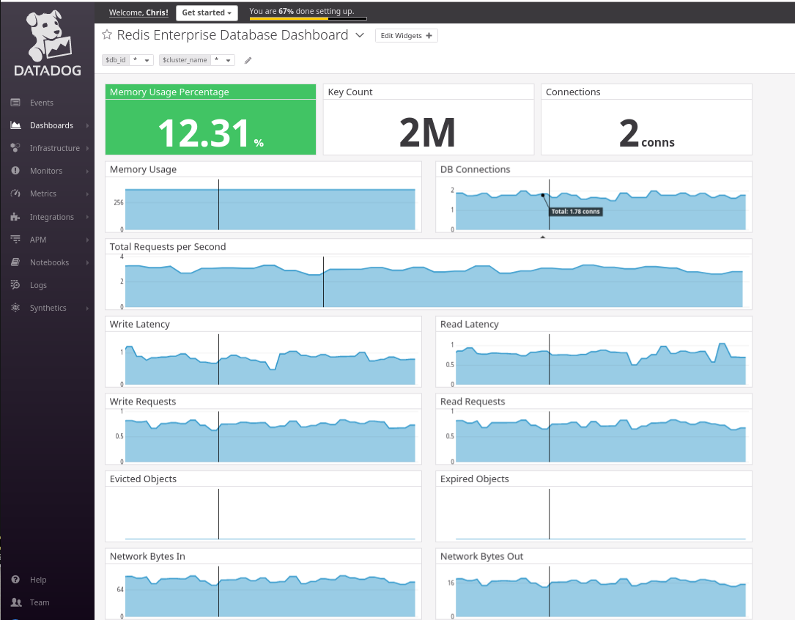
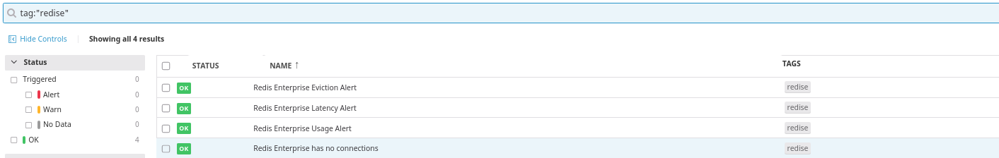
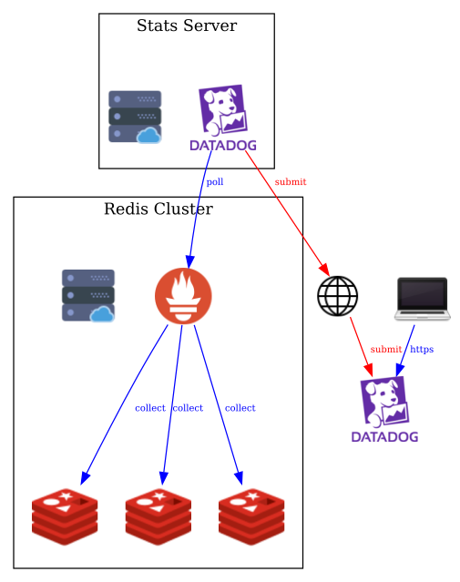
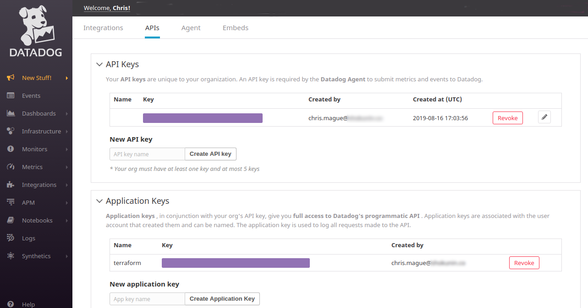
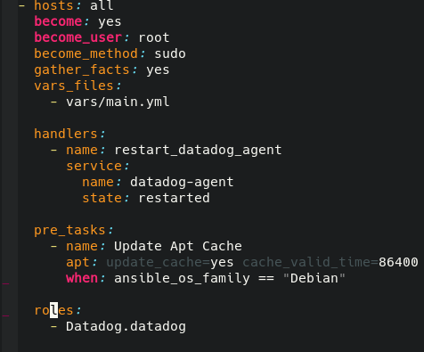
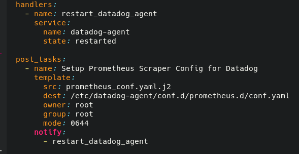
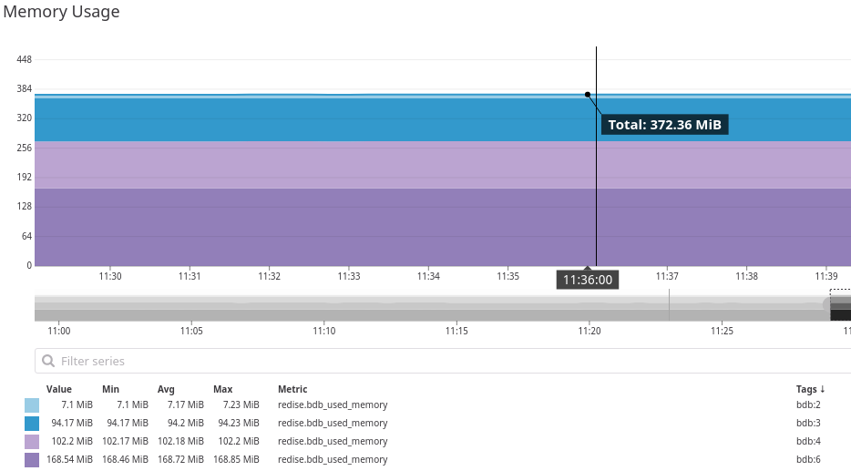

## Monitoring Redis Enterprise with DataDog

### 09/13/2019

<small>Presented by [Chris Mague](mailto:christian@redislabs.com)</small>

---

## Agenda
* End Goal
* Prerequisites
* Configuring Datadog for Programatic Access
* Setting up Datadog Agent
* Collecting data from Redis Enterprise
* Configuring Metadata
* Building dashboards
* Adding monitors
* Collected Data
* Example Monitors

---

### Questions we want to answer
<br>

- How full are my databases?
- What's the latency of my queries?
- Are clients connected?
- Are keys being evicted from my database?

---

 

---

 

---

 

---

## Prerequisites
<small>

| Requirement  | Usage |
|---------------|-----------|
| Datadog API Key  | Needed to send data to Datadog |
| Datadog Application Key  | Needed to create dashboards and alerts |
| Terraform  | for automatically configuring the Datadog dashboards and metadata |
| Ansible  | (optional) for automatically configuring the Datadog agent |
| | |
</small>


---

## Datadog Config

<br>
We need to create API and Application keys for programatic access

[https://app.datadoghq.com/account/settings#api](https://app.datadoghq.com/account/settings#api)

---

## Datadog Config

 

---

### Setting up the Datdog Agent
<br>

- The datadog agent needs to be installed on a node preferably outside of the cluster
- Can be done [manually with a bash script](https://app.datadoghq.com/account/settings#agent)
- Also automated via [Ansible](https://github.com/DataDog/ansible-datadog), [Puppet](https://github.com/DataDog/puppet-datadog-agent) or [Chef](https://github.com/DataDog/chef-datadog)

---

### Datadog Config with Ansible

 

---

### Datadog agent

<small>
- Configuration files
    - /etc/datadog-agent/datadog.yaml (main config - contains API key)
    - /etc/datadog-agent/conf.d/ (integrations)

- Processes
    - stop: sudo systemctl stop datadog-agent
    - start: sudo systemctl start datadog-agent
    - status: sudo systemctl status datadog-agent

</small>

---

#### Collecting Data from Redis Enterprise Manually

<small>
- Configuration files
    - /etc/datadog-agent/conf.d/prometheus.d/conf.yaml

- Processes
    - restart: sudo systemctl restart datadog-agent

</small>

---

#### Collecting Data from Redis Enterprise Automated

 

<small>
Template is available for download [here](https://github.com/Redislabs-Solution-Architects/RE-Datadog-Vagrant/blob/master/ansible/templates/prometheus_conf.yaml.j2)
</small>

---

#### Prometheus Config

```yaml
  - prometheus_url: http://re.example.com:8070/metrics
    ssl_ca_cert: false
    namespace: redise
    max_returned_metrics: 2000
    metrics:
      - bdb_avg_latency
      - bdb_avg_latency_max
      - bdb_avg_other_latency
      - bdb_avg_read_latency
      - listener_acc_latency
      - listener_conns
      ...
```

---

#### Why do we need Metadata?
 

<small>that's better than 7.1 e6</small>

---

#### Configuring Metadata with Terraform
<br>

```json
resource "datadog_metric_metadata" "bdb_used_memory" {
  metric      = "redise.bdb_used_memory"
  short_name  = "Redis Enterprise Database Used Memory"
  description = "Amount of memory in use for the database"
  type        = "gauge"
  unit        = "byte"
}
```


---

#### Configuring Dashboards with Terraform
<small>
```json
provider "datadog" {
  api_key = "${var.datadog_api_key}"
  app_key = "${var.datadog_app_key}"
}

resource "datadog_dashboard" "dbd_dashboard" {
  title         = "Redis Enterprise Database Dashboard"
  description   = "Created using the Datadog provider in Terraform"
  layout_type   = "free"
  is_read_only  = true

  widget {
     query_value_definition{
      request {
        q = "(avg:redise.bdb_used_memory{$db_id,$cluster_name} by {bdb}/avg:redise.bdb_memory_limit{$db_id,$cluster_name} by {bdb})*100"
        conditional_formats {
          comparator = "<"
          value = "80"
          palette = "white_on_green"
        }
        conditional_formats {
          comparator = ">"
          value = "80"
          palette = "white_on_red"
        }
      }
      title = "Memory Usage Percentage"
      precision = 2
      custom_unit = "%"
     }
```
</small>

---

### Configuring Monitors

<small>
```json
resource "datadog_monitor" "no_conns" {
  name               = "Redis Enterprise has no connections"
  type               = "metric alert"
  message            = "There are no connections the the Redis Enterprise Database"
  escalation_message = "Some escalation notification goes here"

  query = "avg(last_15m):avg:redise.bdb_conns{*} by {bdb} < 1"

  thresholds = {
    ok                = 0
    warning           = 2
    warning_recovery  = 4
    critical          = 1
    critical_recovery = 3
  }
  notify_no_data    = false
  renotify_interval = 60
  notify_audit      = false
  timeout_h         = 60
  include_tags      = true
  tags              = ["redise"]
}
```
</small>

---

#### Using terraform to create dashboards, monitors, and metadata

```bash
cd terraform
cp dashboard.tfvars.example dashboard.tfvars

# modify dasboard.tfvars to your API/App keys

terraform init
terraform apply -var-file=dashboard.tfvars
```

---

### Collected Data - Latency
<small>

|metric|definition|
|--|--|
|bdb_avg_latency|average latency of all requests|
|bdb_avg_latency_max|maximum latency|
|bdb_avg_read_latency|average latency of read requests|
|bdb_avg_write_latency|average latency of write requests|
|bdb_avg_other_latency|average latency of other requests|
|||
</small>
<div align="left">Latency is measure from time the request hits the proxy until the response is sent back over the network</div>

---

### Collected Data - Requests
<small>

|metric|definition|
|--|--|
|bdb_write_req|number of write operations per database|
|bdb_read_req|number of read operations per database|
|bdb_other_req|number of read operations per database|
|bdb_total_req|number of total operations per database|
|bdb_total_req_max|maximum number of total operations per database|
|||
</small>

---

### Collected Data - Keys
<small>

|metric|definition|
|--|--|
|bdb_no_of_keys|number of keys in the database|
|bdb_expired_objects|number of keys that have exceeded their TTL|
|bdb_evicted_objects|number of keys that have been pushed out to make room for new keys|
|||
</small>

---

### Collected Data - Resources
<small>

|metric|definition|
|--|--|
|bdb_used_memory|Amount of memory used by the DB|
|bdb_ingress_bytes|Network traffic coming into the DB|
|bdb_egress_bytes|Network traffic coming out the DB|
|bdb_fork_cpu_system|% cores utilization in system mode for all redis shard fork child processes of this database|
|bdb_main_thread_cpu_system|% cores utilization in system mode for all redis shard main threas of this database|
|bdb_main_thread_cpu_system_max|maximum % cores utilization in system mode for all redis shard main threas of this database|
|||
</small>

---

#### Example Monitors
- No Active Database Connections
```
"avg(last_15m):avg:redise.bdb_conns{*} by {bdb} < 1"
```

- High Database Request Latency (10ms)
```
"avg(last_15m):avg:redise.bdb_avg_latency{*} by {bdb} > 0.01"
```

- Database Key Eviction
```
"avg(last_5m):avg:redise.bdb_evicted_objects{*} by {bdb} > 0"
```

- Database Usage
```
"avg(last_5m):( avg:redise.bdb_used_memory{*} by {bdb} 
 / avg:redise.bdb_memory_limit{*} by {bdb} ) * 100 > 85"
```


---

## Thank you
<br><br>
<small>Contact: [Chris Mague - christian@redislabs.com](mailto:christian@redislabs.com)</small>
